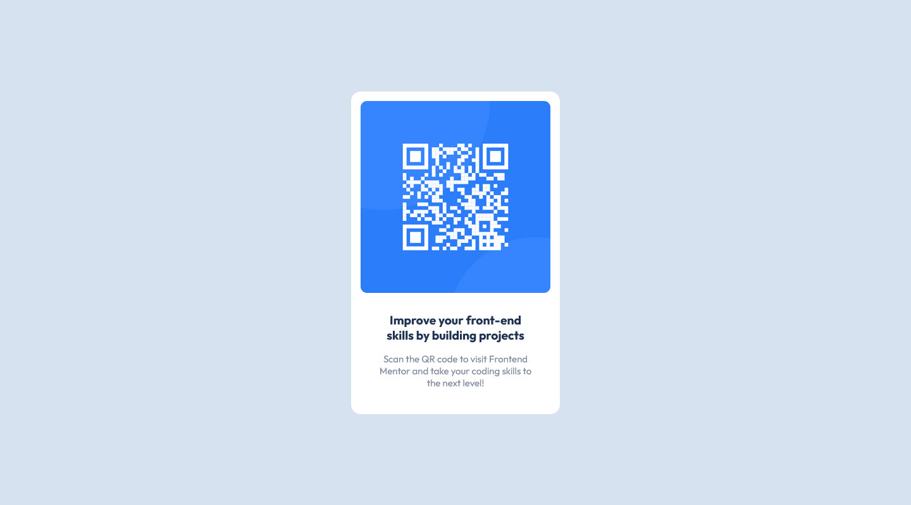

# Frontend Mentor - QR code component solution

This is a solution to the [QR code component challenge on Frontend Mentor](https://www.frontendmentor.io/challenges/qr-code-component-iux_sIO_H). Frontend Mentor challenges help you improve your coding skills by building realistic projects. 

## Table of contents

- [Overview](#overview)
  - [Screenshot](#screenshot)
  - [Links](#links)
- [My process](#my-process)
  - [Built with](#built-with)
  - [What I learned](#what-i-learned)
  - [Continued development](#continued-development)
  - [Useful resources](#useful-resources)
- [Author](#author)
- [Acknowledgments](#acknowledgments)


## Overview
QR-Code Component mock up design in html and css challenge by Frontend Mentor.

### Screenshot



### Links

- Solution URL: [qr-code-1](https://github.com/badkmw/QR-Code-Challenge/tree/FrontEndMentor-Challenges)
- Live Site URL: [replit.com](https://qr-code-1--badkmw.repl.co/)

## My process

### Built with

- Semantic HTML5 markup
- CSS custom properties
- Flexbox
- CSS Grid
- Mobile-first workflow

### What I learned

I learned more of flexbox and grid. I also learned how to center an element using margins.

An Example of some of my code:
```css
main {
  display: flex;
  flex-direction: row;
  flex-wrap: wrap;
  margin: auto;
  width: 100%;
}
```


### Continued development

Definently flexbox and grid, mixing the two to create stunning layouts. 

### Useful resources

- [CSS Layout Generator](https://layout.bradwoods.io/) - This helped me for figuring out flexbox and grid. I really liked the way it simplifies layouts and will use it going forward.

## Author

- Frontend Mentor - [@badkmw](https://www.frontendmentor.io/profile/yourusername)
- Twitter - [@bderrickmatthew](https://twitter.com/bderrickmatthew)

## Acknowledgments

Well I would like to thank Frontend Mentor for the designs.
